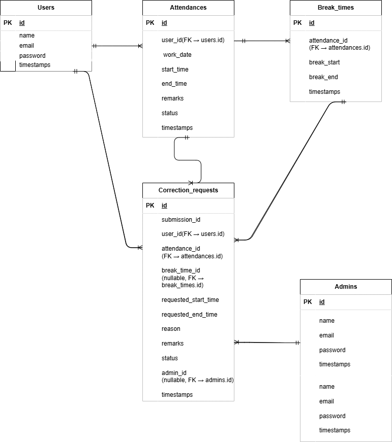

# プロジェクト名
勤怠管理アプリ（Laravel）

## 概要
このアプリは、一般ユーザーと管理者が利用する勤怠管理システムです。
- ユーザーは「出勤」「退勤」「休憩」の打刻や修正申請が可能
- 管理者は「勤怠一覧の確認」「勤怠の修正」「ユーザーからの修正申請の承認」が可能

## 使用技術
- PHP 8.4.6 / Laravel 8.83.8
- MySQL 8.0.26
- Blade / CSS
- Laravel Fortify（認証）
- Docker（nginx, php-fpm, mysql, phpmyadmin）

## 環境構築

### Dockerビルド
1. git clone git@github.com:hiroya-0425/mockcase2.git
2. DockerDesktop アプリを立ち上げる
3. docker-compose up -d --build


### Laravel 環境構築

1. docker-compose exec php bash
2. composer install
3. 「.env.example」ファイルを コピーして「.env」を作成し、DB の設定を変更
```bash
cp .env.example .env
```
```env
DB_HOST=mysql
DB_DATABASE=laravel_db
DB_USERNAME=laravel_user
DB_PASSWORD=laravel_pass
```
5. アプリケーションキーの作成
```bash
php artisan key:generate
```
6. マイグレーションの実行
```bash
php artisan migrate
```
7. シーディングの実行
```bash
php artisan migrate:fresh --seed
```
### シーディングデータ
| 種別       | 名前     | Email                   | パスワード    |
|------------|----------|-------------------------|---------------|
| 一般ユーザー | 山田 太郎 | taro@example.com        | password123   |
| 一般ユーザー | 佐藤 花子 | hanako@example.com      | password123   |
| 管理者ユーザー | 代居 大哉 | hiroya-ydh@example.com | hirohiroya    |

勤怠データ
- AttendanceSeeder で勤怠データを自動投入

### 主な機能
- 一般ユーザー側

 - 出勤 / 退勤 / 休憩 の打刻
 - 勤怠一覧表示（日次・月次）
 - 勤怠修正申請（出退勤・休憩時間）
 - 申請一覧（承認待ち / 承認済み）

- 管理者側

 - スタッフ一覧
 - 各スタッフの月次勤怠表
 - 勤怠詳細（出勤退勤・休憩・備考）
 - 修正申請の承認

### ER図



### テスト環境構築
`.env.testing` を作成し、以下のように設定してください。
```env
DB_CONNECTION=mysql
DB_HOST=mysql
DB_PORT=3306
DB_DATABASE=laravel_test_db
DB_USERNAME=laravel_user
DB_PASSWORD=laravel_pass
```
1. MySQL コンテナにログイン
```bash
docker exec -it mockcase2-mysql-1 mysql -u root -p
```
2. テスト用DB作成
```bash
CREATE DATABASE IF NOT EXISTS laravel_test_db CHARACTER SET utf8mb4 COLLATE utf8mb4_unicode_ci;
```
3. 権限付与
```bash
GRANT ALL PRIVILEGES ON laravel_test_db.* TO 'laravel_user'@'%';
FLUSH PRIVILEGES;
```
4. マイグレーション実行
```bash
docker-compose exec php bash
php artisan migrate --env=testing
```

### テスト実行
```bash
php artisan test
```
### 注意事項(要件についてコーチと話し合って作成したもの)
- 勤怠登録画面にはリアルタイム時計を表示。JavaScript により 1 秒ごとに更新され、ページリロードをせずとも現在時刻を表示するようにしています。
- 勤怠時間の計算は 秒単位で算出し、1秒でも跨げば1分として切り上げる仕様としています。
- 一般ユーザーが修正申請を行った際、修正前と修正後の両方を保持する仕様としています。
- 日付をまたぐシフトは考慮していません。